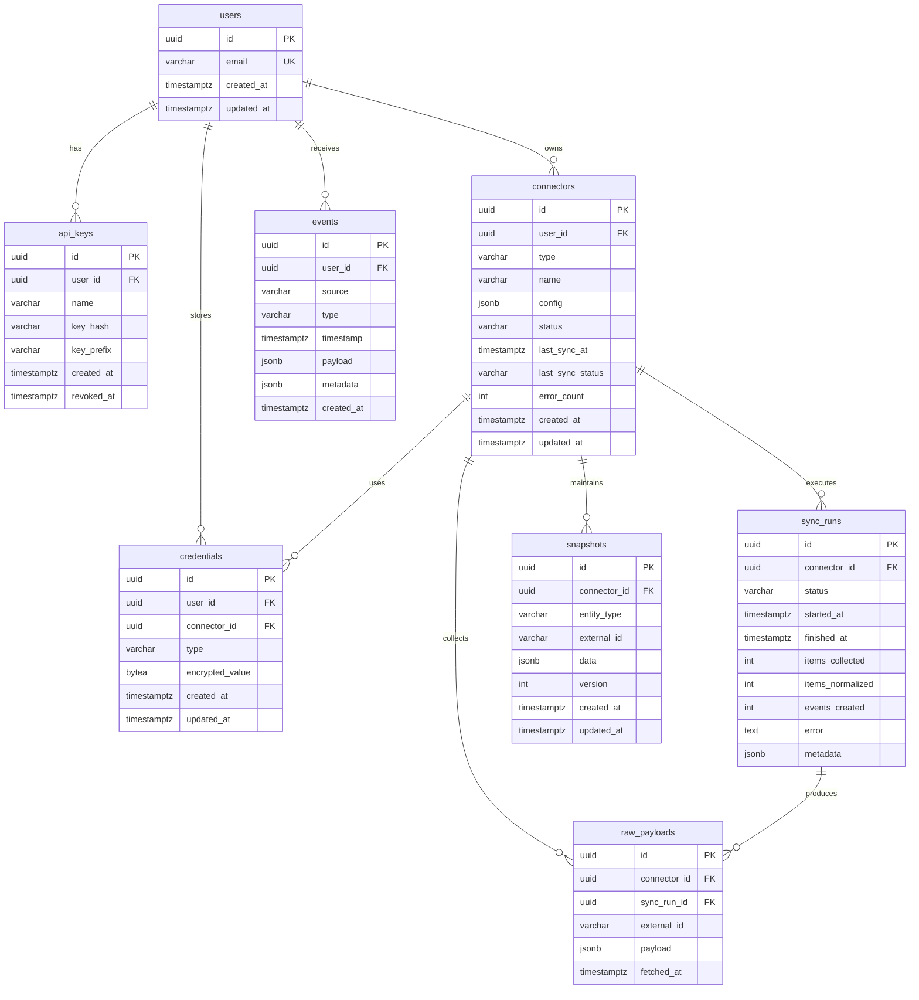

# ER Diagram

> [!IMPORTANT]
> **EXTERNAL REFERENCE — PKS DATA PRODUCT**
> This diagram describes the **PKS data product** database (backend in `Autocomplete/`), **not** the `autocomplete-ui` project. Reference only; do not modify. Source of truth: `Autocomplete/docs/`.



## Relationships

| From | To | Cardinality | Description |
|------|----|-------------|-------------|
| users | api_keys | 1:N | User can have multiple API keys |
| users | connectors | 1:N | User owns connectors |
| users | events | 1:N | Events belong to user |
| users | credentials | 1:N | User has credentials |
| connectors | credentials | 1:1 | Each connector has credentials |
| connectors | sync_runs | 1:N | Connector has sync history |
| connectors | raw_payloads | 1:N | Connector collects payloads |
| connectors | snapshots | 1:N | Connector maintains snapshots |
| sync_runs | raw_payloads | 1:N | Sync run produces payloads |

## Key Constraints

- `api_keys.key_hash` — unique index for fast lookup
- `snapshots (connector_id, entity_type, external_id)` — unique, one snapshot per entity
- `events` — append-only, no FK to snapshots (events are immutable history)
- `credentials.encrypted_value` — BYTEA, never queried by value

## Index Strategy

```
events:
  idx_events_user_type_timestamp (user_id, type, timestamp DESC)  -- primary query pattern
  idx_events_source (source)
  idx_events_timestamp (timestamp DESC)

snapshots:
  uq_snapshots_connector_entity (connector_id, entity_type, external_id)  -- upsert target

connectors:
  idx_connectors_user_id (user_id)
  idx_connectors_type (type)

sync_runs:
  idx_sync_runs_connector_started (connector_id, started_at DESC)

raw_payloads:
  idx_raw_payloads_fetched_at (fetched_at)  -- retention cleanup
```
