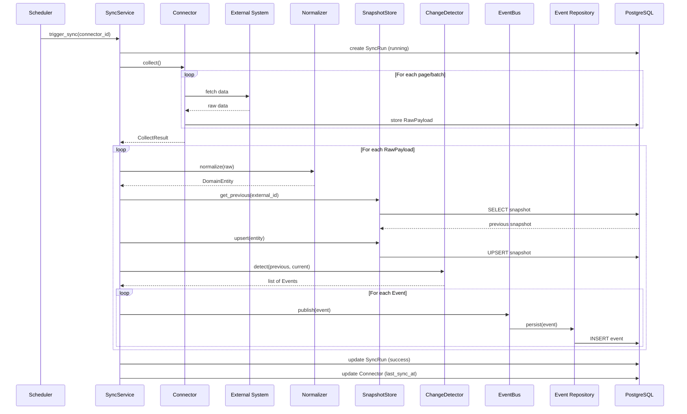
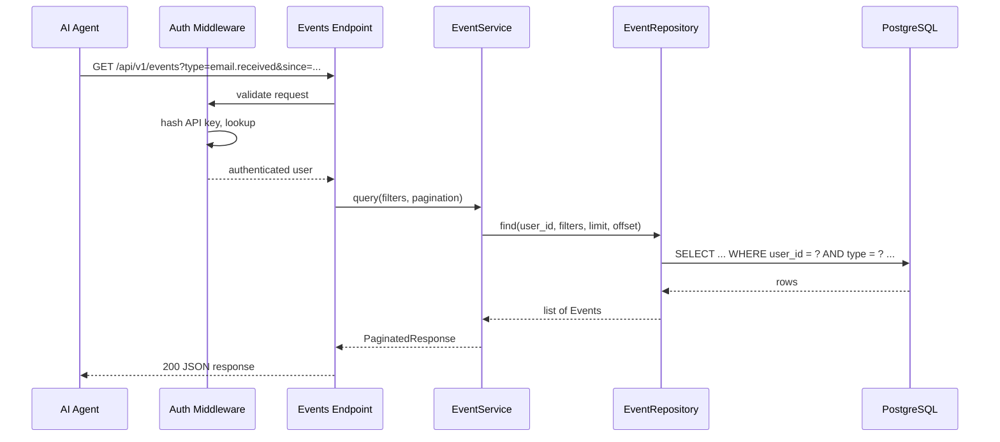
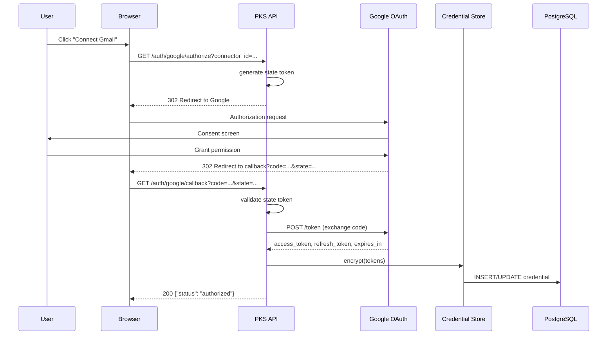
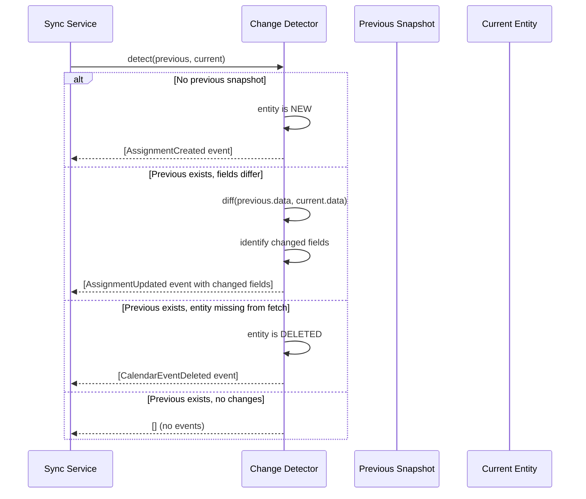
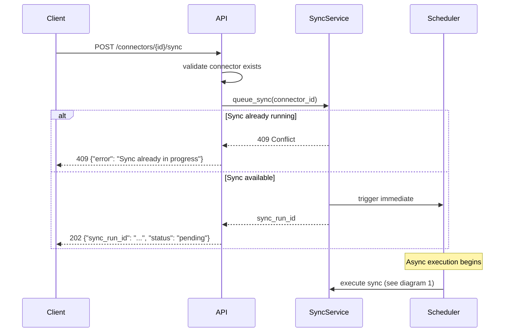
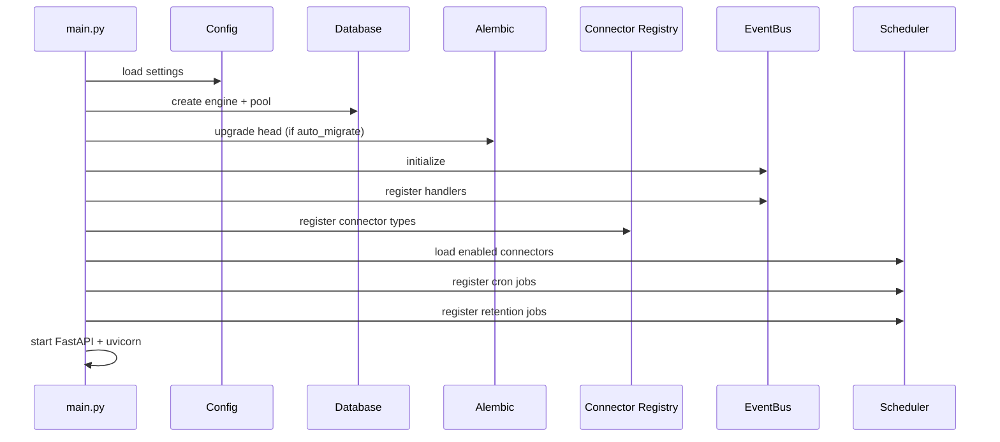

# Sequence Diagrams

> [!IMPORTANT]
> **EXTERNAL REFERENCE — PKS DATA PRODUCT**
> These diagrams describe **PKS data product** flows (backend in `Autocomplete/`), **not** the `autocomplete-ui` project. Reference only; do not modify. Source of truth: `Autocomplete/docs/`.

## 1. Connector Sync Flow

---

## 2. API Event Query Flow

---

## 3. Google OAuth Flow

---

## 4. Change Detection Detail

---

## 5. Manual Sync Trigger

---

## 6. Application Startup

